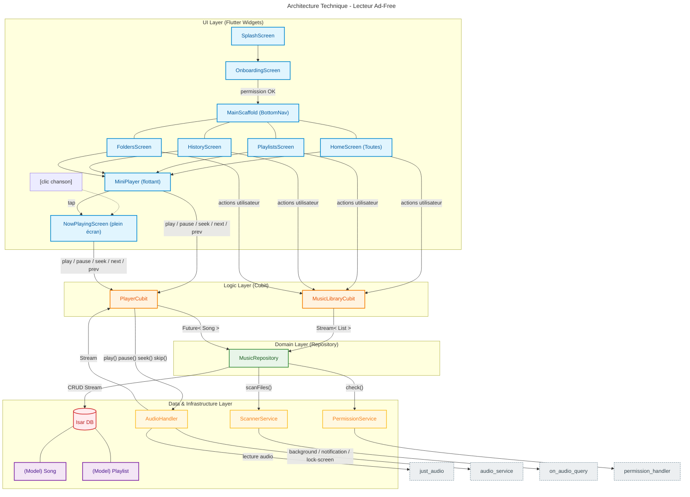

# Music Player App Requirements

Flutter Music Player App: Music Player App (https://app.notion.com/p/Music-Player-App-38fa4a887ed580409343d0566e1defdf?pvs=21)
Status: Done
Type: Guideline

## Cahier des charges : Lecteur Musique "Ad-Free"

### 1. Périmètre du MVP (La priorité pour la semaine)

L'objectif est d'avoir une application fonctionnelle de bout en bout avant d'ajouter des fioritures.

- **Scan & Persistance :** Scan des fichiers audio locaux et stockage via **Isar** (Modèle `Song` avec `filePath`, `title`, `artist`).
- **Navigation Principale :** 4 onglets : *Accueil* (Toutes les chansons), *Playlists* (dont Favoris), *Historique* (trié par `lastPlayed`), *Dossiers*.
- **Lecteur Audio :** Lecture, Pause, Suivant, Précédent, Barre de progression (seek).
- **Gestion État :** Lecteur accessible via clic sur chanson ou Mini-Player flottant (le `Now Playing` plein écran est ouvert via ces deux points d'entrée uniquement).
- **Background :** Service audio actif (Notifications, Lock-screen) avec `audio_service`.

### 2. Contraintes techniques

- **Architecture :** MVC (Séparation stricte : Modèle Isar, Vue Flutter, Cubit).
- **Gestion d'état :** **Cubit** pour la logique de navigation et de lecture.
- **Persistance :** **Isar** (Recommandé pour la vitesse de lecture/écriture locale).
- **Audio :** `just_audio` + `audio_service` (obligatoire pour le background).
- **Tests :** 2 tests unitaires minimum par fonction métier (scan, CRUD playlist, logique de lecture).

### 3. Évolutions (À ajouter APRES le MVP)

- **Gestion avancée des métadonnées :** Extraction automatique des pochettes (`Artworks`) et affichage propre.
- **Animations :** Transitions fluides entre le Mini-Player et le lecteur plein écran.
- **Thème Dynamique :** Utilisation du package `palette_generator` pour adapter l'UI aux couleurs de la pochette.
- **GitHub Actions :** Automatisation du déploiement des tests.

### 4. Flow des pages de l’application

### 5. Designs potentiel de l’application

[https://app.notion.com](https://app.notion.com)

### 6. Architecture de l’application

Cette architecture repose sur le principe de séparation des préoccupations : chaque couche est isolée, ce qui rend l'application **testable, fluide et facile à maintenir**.

### a. La Couche Données (Data Layer)

- **Modèle (`Song`, `Playlist`) :** Définit la structure des objets stockés dans la base de données.
- **Base de Données (`Isar`) :** Source de vérité persistante.
- **Services Techniques :**
    - `ScannerService` : Interface avec le système de fichiers pour extraire les métadonnées (ID3).
    - `PermissionService` : Interface avec l'OS pour valider l'accès au stockage.

### b. La Couche Abstraction (Domain Layer)

- **`MusicRepository`** : Le pivot central. Il ne contient aucune logique UI. Il orchestre les appels entre le `ScannerService` et `Isar`, et fournit des `Stream` et `Future` aux Cubits. Il garantit que l'UI ne manipule jamais directement les fichiers ou la base de données.

### c. La Couche Logique (Bloc/Cubit Layer)

- **`MusicLibraryCubit`** : Gère l'état de la bibliothèque (chargement, filtrage, dossiers). Il communique avec le `MusicRepository`.
- **`PlayerCubit`** : Agit comme une télécommande. Il traduit les actions de l'utilisateur en ordres pour l'`AudioHandler` et demande au `Repository` de charger les données d'une chanson.

### e. La Couche Système (Hardware Layer)

- **`AudioHandler`** : Interface avec `just_audio` et `audio_service`. Il gère le processus d'arrière-plan, la notification, le verrouillage de l'écran et le flux audio brut. C'est le seul composant capable de communiquer avec le matériel audio du téléphone.

### Flux de contrôle (Résumé)

1. **UI ➔ Cubit ➔ Service :** L'UI envoie une intention au Cubit.
2. **Cubit ➔ Repository :** Le Cubit demande des données (ex: "donne-moi la chanson X") ou une action (ex: "scanne le disque").
3. **Repository ➔ Services/DB :** Le Repository exécute l'action via le service approprié (`Scanner` ou `Isar`).
4. **AudioHandler ➔ Cubit :** L'`AudioHandler` informe le `PlayerCubit` des changements d'état (lecture, pause, piste suivante) via des `Streams`.

### 8. Packages a ajouter pour le projet

### 1. Le Cœur Audio & Système

- **`just_audio`** : Le moteur de lecture audio haute performance.
- **`audio_service`** : Indispensable pour gérer la lecture en arrière-plan et les notifications système.
- **`audio_session`** : Gère les interruptions audio (appels, autres apps) pour garantir une expérience propre.

### 2. Accès aux données & Fichiers

- **`on_audio_query`** : Pour scanner le système, extraire les métadonnées (Artiste, Titre, Pochette) et lister les chansons/dossiers.
- **`permission_handler`** : Pour demander les accès système (`READ_MEDIA_AUDIO`).

### 3. Architecture & Base de Données

- **`isar_community` / `isar_community_generator`** : Notre moteur de base de données ultra-rapide pour stocker tes playlists et favoris.
- **`get_it`** : Le Service Locator pour injecter tes services et ton Repository dans toute l'application.
- **`flutter_bloc`** : Pour gérer la logique d'état (Cubit) de manière prévisible.
- **`path_provider`** : Pour accéder aux dossiers de stockage locaux du téléphone.
- **`shared_preferences`** : Pour les réglages légers (ex: mode Loop, Shuffle).

### 4. Utilitaires & Debug

- **`logger`** : Pour remplacer les `print()` par des logs structurés et lisibles en console.
- **`equatable`** : Pour simplifier la comparaison d'objets dans tes modèles et états Bloc.